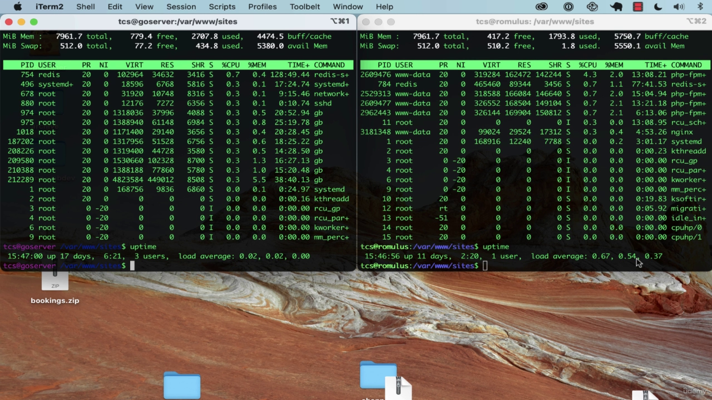

# udemy-building-modern-web-applications-with-go

## Section 1: Introduction

### What we will do?

- Learn the fundamentals of Go programming language
- Learn how to build a web application with Go
- Learn how to deploy a web application to a live server

### Why go?

- compiled language, single binary file (fast)
- no runtime to worry about
- statically typed, so no surprises at runtime
- object-oriented (sort of), but not class based
- concurrency built in
- garbage collected
- cross-platform
- excellent package management and testing built in

now, let look at examples:

- the left terminal is running a Go program, and the right terminal is running a PHP program. then we run command `top`
  and `uptime` to see load of each server:



- as we can see that the server that running Go program has a lower load than the server that running PHP program. this
  is because Go is a compiled language, so it's faster than PHP, which is an interpreted language.

### Install Go:

- [download Go](https://go.dev/dl/) and install Go for your OS
- start your terminal and run command `go version` to check if Go is installed successfully

```shell
$ go version
go version go1.20.4 darwin/amd64 # my version

```

- [set up Go workspace](https://golang.org/doc/code.html#Workspaces)
- install your favorite IDE or text editor. I will use [GoLand](https://www.jetbrains.com/go/) for this course.

### Hello, World!

- now we can start coding a small program to test if everything is working fine.
- first we need to initialize a Go module by running command `go mod init <full package name>`, in my case, I initialize
  a Go module with name `github.com/SarathLUN/udemy-building-modern-web-applications-with-go/section-01`

```shell
$ go mod init github.com/SarathLUN/udemy-building-modern-web-applications-with-go/section-01
go: creating new go.mod: module github.com/SarathLUN/udemy-building-modern-web-applications-with-go/section-01
go: to add module requirements and sums:
        go mod tidy

```

- from there, if we list our directory, we can see that a file `go.mod` is created. this file is used to manage
  dependencies for our project.

```shell
$ ls
go.mod

```

- let checkout the content of `go.mod` file:

```shell
$ cat go.mod
module github.com/SarathLUN/udemy-building-modern-web-applications-with-go/section-01

go 1.20

```

- create a file `main.go` and add the following code:

```go
//main.go

package main

import "fmt"

func main() {
	fmt.Println("Hello, World!")
}

```

- run command `go run main.go` to run the program. you should see the output `Hello, World!` in your terminal.

```shell
>go run main.go
Hello, World!

```

### Variables & Functions

- in Go, we use `var` keyword to declare a variable with Camel case name convention. the syntax is:

  ```go
  var variableName variableType
  ```

- we can assign value to a variable by using `=` operator. the syntax is:

  ```go
  variableName = value
  ```

- we must use the variable after we declare it, otherwise we will get an error.
- here we make use of variable by print it out with `fmt.Println()` function. the syntax is:

  ```go
  fmt.Println(variableName)
  ```

- we can also declare package level variable by using `var` keyword outside any function.
- now we create a function `saySomething` that return a string in the `main.go` file.
- we can use short declaration operator `:=` to declare and assign value to a variable. the syntax is:

  ```go
  variableName := value // the data type will be inferred from the type of value
  ```

- function in Go can return more than 1 value, checkout function `saySomethingElse` that return `string` and `int`.
- checkout the code in [variable-and-function.go](variable-and-function.go) file.
